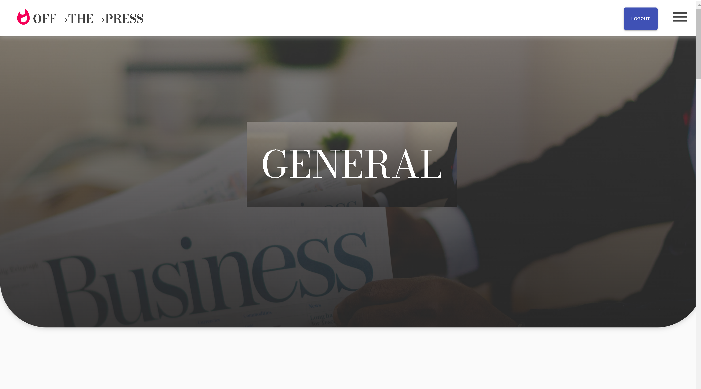

# Submission Requirements
## Project Description
- A high level architectural overview of your web application. e.g. names, relationships and purposes of all components and relevant data models
- Brief description of the architectural design pattern that you leveraged (MVC, MVP, MVVM)
- Screenshots of each View and descriptions of the overall user flow as well as any place that you made distinct design decisions.  (Screenshots can be taken via any screenshot capture application or native methods).


## Project Requirements
Please list examples of how your project meets the following requirements below:
- [x] Use a modern JS Library/Framework like React, Angular, etc. We suggest using React.js.

- [x] Create an application that can be interacted with in a minimum of three different ways by the user.

- [x] Use of at least one Service.

- [x] The usage of a specified architectural pattern (MVC, MVP, MVVM,  etc.)

- [x] Use of a [REST API](https://medium.com/@arteko/the-best-way-to-use-rest-apis-in-swift-95e10696c980).
- [x] Usage of at least 5 UI components from the [material-ui/@core](https://material-ui.com/) library (if you are not using React, a comparable UI library is acceptable)

- [x] An example of a reusable UI component that you have created and used in the app. This should be different than the 5 UI components from the vendor library.


***
***

## Description
### High Level Overview
- `HotOFFThePress` is a news feed web application that displays current headlines from 7 different categories: `Business, Generel, Sports, Science, Health, Entertainment, and Tech`. This was a major design decision for me to choose to split up the functionality in 7 different topics as opposed to aggregating them all at once. This approach is more pleasant for the user to view stories of related topics, and it proposes a challenge to make the site structured, dynamic, and partiitioned. I named the site `hotOFFThePress` to eximplfy the expediency and urgency of todays news. It's fast, and it's HOT!

The [datanNewApi](https://datanews.io/docs) was used to collect this data. It was simple to work with, and provided all previously proposed categories along with `image and article url's`, `titles`, and `descriptions` for the user to explore further. 

Api Payload and Response for `POST` req to `/api/dataNewsApi`

```javascript
{
  "status": 200,
  "numResults": 2,
  "hits": [
    {
      "url": "https://business.financialpost.com/technology/europe-throws-new-rule-book-at-google-tech-giants-to-loosen-market-grip",
      "source": "business.financialpost.com",
      "authors": [],
      "title": "Europe throws new rule book at Google, tech giants to loosen market grip",
      "pubDate": "2020-07-02T13:40:43+00:00",
      "country": "us",
      "language": "en",
      "description": "EU's new regulations could become a template for governments around the world looking to rein in Google, Apple, Amazon and Facebook",
      "imageUrl": "https://financialpostcom.files.wordpress.com/2020/07/tech.jpg",
      "content": "..."
    },
    ...
  ]
}
```
This json object is returned and extracted into the correct fields on the `NewsFeed` page on the Front End.


### Componets:
- `User Authentication` (Session page)
    - I decided to make the site inaccesible for the news feed without being logged in. This deters potentional bad actors and adds more personalized features down the line including profile pictures, bookmarking stories (have the route created just haven't implement it on the Front End)
    - The database schema is storing relations to books marks that isn't implemented, but I wanted to add it as a stretch goal. It is `nullable`
    - The username will also display in the future when logged in
        
- `Landing` page
    - It's important from a UI/UX perspective to have a smooth, loud, and visually stimulating landing page to draw users in. Adding the interactive gallery was a key feature in doing so. 
- `NewsFeed` page
    - Showcases current headling in the particular category selected

The biggest challenge was incorporating Typescript on the Front End (React) as well as the Back End, as I am still new to the language. I quickly found that Typescript, although time consuming in the beginning, was a more efficient approach and I had few errors to debug because of it. 

I had a blast building the application. Thanks for the oppurtunity. I learned a lot these past 7 days! Happy Coding~

## Views
1. `Landing`

    - reusable header with a modern design. I thought it looked loke a typewriter which followed the new them
 
    - creative interactive gallery that captivates users

    - standard footer with site links
2. `authentication`

    - creative design with asynmmetrice slope which breaks up the monotony of square boxes. common theme in this project
3. `NewFeed`

    - reuasable headers for the specific categories


    - again, different shapes break up the boring box shapes. I wanted the grid to be fun with circles instead of cards
4. `sidebar`

    - navigation for categories
5. Reusable elements

    - button and hamburger menu
6. `fire emblem`

7. 
- Accessibility
    - I used semantic html elements as well as entered in meaningful alt for all images. I made use of `section, figure, figcaption, main, header, h1, h2, h3`. All nested the correct way to boost SEO and screen reading
8. `404`

    - Fun 404 page that utilized the header again. I like that it looks likes a typewriter
9. `Front End Folder Structure `

    - The components were broken up into meaningful parts to keep code DRY
        - pages for full rendered page
        - utilties for load spinners and error display
        - hocs for protected routes


### 7-in-1 SASS design
I used the 7 in 1 SASS design to keep code DRY and structured. All partials are imported to index.css. 
(the other two of the 7 in this pattern are left out because they weren't used)
- abstracts
- base
- components
- layouts
- pages

## Requirements
1. My modern library of choice was to use `React` with Typescript, as I am most comfortable using it. I leveraged modern React/Redux hooks to speed up development and keep all components function components. React was used to build the entire Front End. 

2. All Interactions of the user: 
    - Login
    - Signup
    - View 7 different categories(`Business, Generel, Sports, Science, Health, Entertainment, and Tech`) of current news feeds with sidebar navigation.
    - interactive gallery on `Landing` page
    - Update new query result

3. Services Used: 
    1. `dataNewsApi`
        - returned `imageUrl`, `url`, `description`, `title`, `pubDate` to be displayed on the Front End. 
    2. `Atlas` cloud system
        - Integrated with Mongoose ODM to store collections (currently only users)

4. Rest Api:
    - Since users are the only collections being received from the database I didn't need to add any crazy nesting logic for the rest api endpoints on the Back End. I appended all routes with `/api` followed by the resource or collection being retrieved. Examples:
    `/api/dataNewsApi`, `/api/session`. prepending `api` makes it more explicit about where the request is going.

    I plan on adding the ability to add bookmarks, so i added this route to use later: `/api/users/:id/bookmarks`. This follows standard rest api principals with an id after the collection, followed by another collection or single resource that belongs to the user. 

5. Material Ui components:
    1. `Button `(logout, signup, login)
        - note: all other buttons are made manually in css
    2. `TextField`(login, logout form)
    3. `Loading Spinner`(to view when retrieving news articles)
    4. `Drawer/Sidbar`(navigation of different categories)
    5. `Icons`
        - Used in `hotoffthepress` logo - fire emblem
        - `hamburger menu` for sidebar

6. I decided to go with the `MVC design pattern`, which allowed me to follow the `seperation of concerns` principal. I seperated out the `routers` into a seperate `routes` directory as well as placing the logic to start the server and test the database connection into a serperate `bin` script. I made a `controllers` folder which houses the api logic for returning `custom errors`, `pinging the dataNewsApi` and `query the mongodb database` for user authentication. This allowed me to keep the app.js file and the routers concice and partitioned which will bear on the side of scalability later. 


7. Reusable UI components:
    - I use a few reusable components I made because it made development easier. This, in conjustion with the `7 in 1` design pattern in SASS greatly reduced potential duplicate code. 
        1. `Header`
            - appended to the top of the following pages: `Landing page`, `all 7 different categories pages`, `404 page`
            - Using conditional logic I was able to make one component for the 7 different categories, but by passing props in React I was able to pass the necessary information to customize the `color` and `text heading` on the page. the `category` was passed down in the props. 
        2. `custom animated button` (`btn` class):
            - Used in  `header`, and the two buttons on the `NewsFeed` page (`New Results` and `Load More`)
        3. The `circular figure clip` for the images displayed on the news feed in the grid. 
    